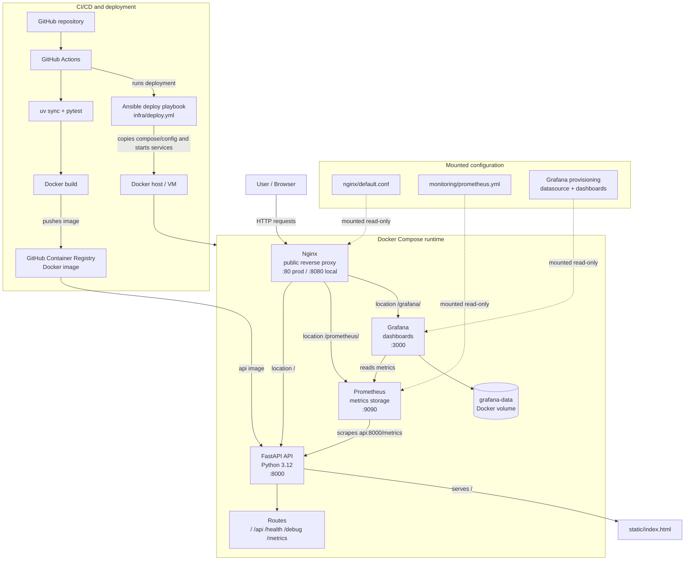

# Project Architecture

This project is a containerized FastAPI web application. Nginx is the public
entry point, FastAPI serves the application and API endpoints, Prometheus
collects metrics, Grafana displays dashboards, and GitHub Actions with Ansible
handles build and deployment.

## Main Elements

- **User / Browser** sends HTTP requests to the application through the public
  Nginx endpoint.
- **Nginx** is the reverse proxy for the whole system. It exposes port `80` in
  production and port `8080` in local Docker Compose, forwards application
  traffic to FastAPI, and routes `/prometheus/` and `/grafana/` to the
  monitoring services.
- **FastAPI API** is the Python 3.12 application container. It serves the
  static home page from `static/index.html` and exposes the main routes:
  `/api`, `/health`, `/debug/{return_code}`, and `/metrics`.
- **Prometheus** collects application metrics from the FastAPI `/metrics`
  endpoint using `monitoring/prometheus.yml` and stores time-series data for
  monitoring.
- **Grafana** reads metrics from Prometheus and renders dashboards. Its
  datasource and dashboard definitions are provisioned from the
  `monitoring/grafana/provisioning` and `monitoring/grafana/dashboards`
  directories, while `grafana-data` persists Grafana state.
- **Docker Compose runtime** starts and connects Nginx, FastAPI, Prometheus,
  and Grafana. The local compose file builds the API image from the repository;
  the production compose file pulls the API image from GitHub Container
  Registry.
- **Mounted configuration** keeps infrastructure settings outside container
  images. Nginx, Prometheus, and Grafana receive their configuration from files
  mounted into their containers as read-only volumes.
- **Delivery pipeline** runs tests, builds the Docker image, pushes it to GitHub
  Container Registry, and uses the Ansible playbook in `infra/deploy.yml` to
  copy configuration to the host and start the Docker Compose stack.

